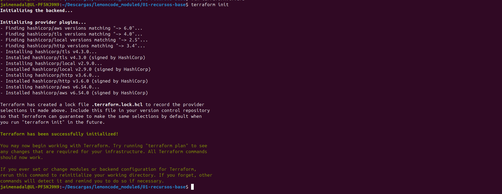
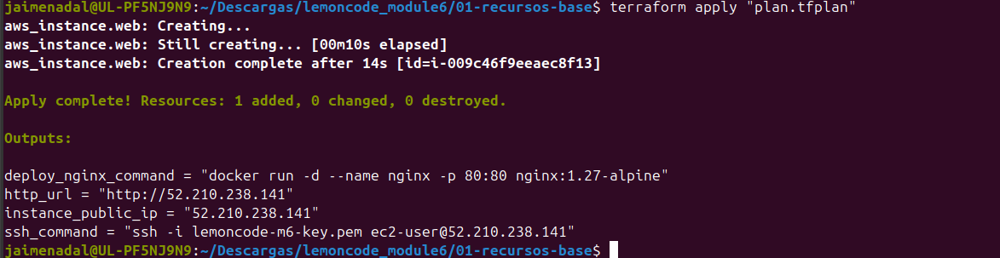
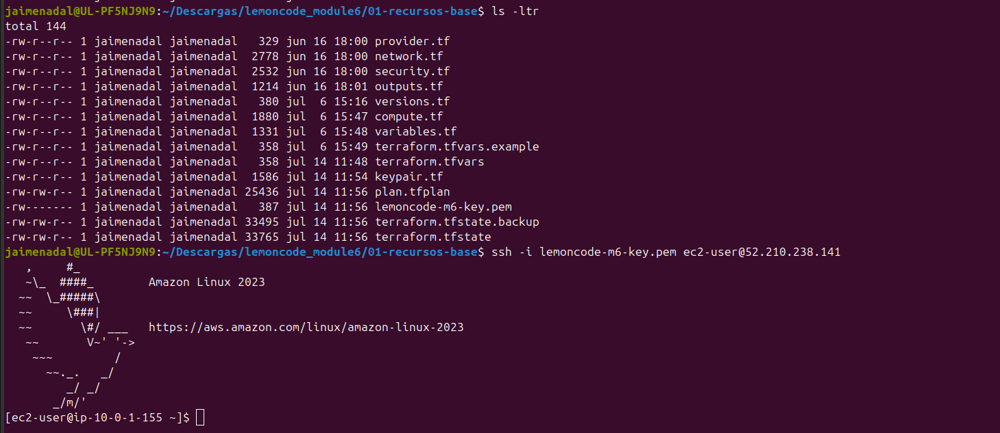
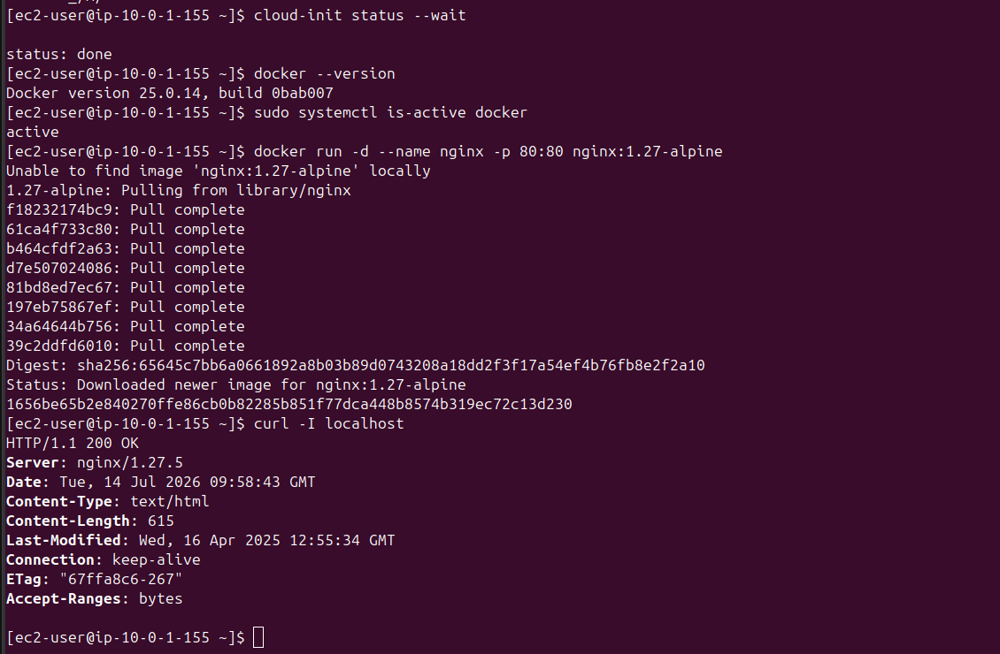
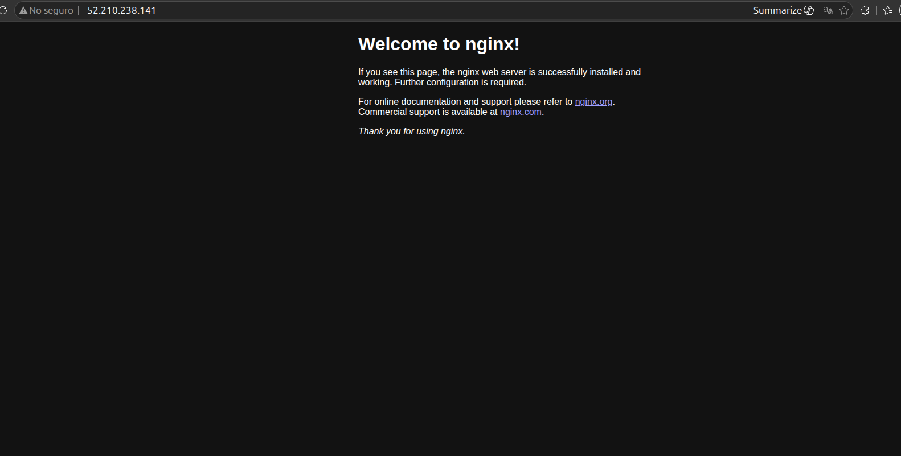
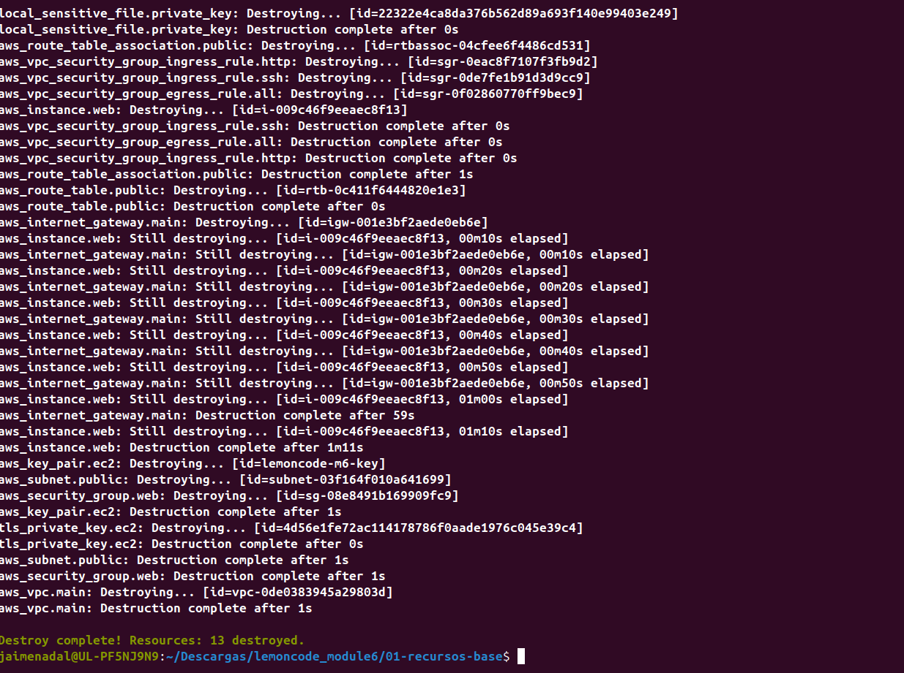

# Fase 1 — Recursos base (`01-recursos-base/`)

Bootcamp DevOps · Módulo 6 · Infraestructura como Código (Terraform + AWS).

Esta fase cubre los **puntos 1–7** del enunciado creando la red con recursos
individuales de Terraform (sin módulos). Región `eu-west-1`; instancia `t3.micro`
(elegible para el free tier en cuentas nuevas); AMI Amazon Linux 2023.

## Cobertura del enunciado

| Punto | Qué pide | Dónde se implementa | Evidencia |
|---|---|---|---|
| 1 | VPC con acceso a internet (CIDR + IGW) | `network.tf` | init / plan / apply |
| 2 | Subnet pública + route table + ruta a IGW + asociación | `network.tf` | apply |
| 3 | Security group: 80 abierto, 22 solo mi IP | `security.tf` | apply |
| 4 | Key pair para SSH | `keypair.tf` | fichero `.pem` generado |
| 5 | EC2 en la subnet, AMI free tier, SSH | `compute.tf` | SSH conectado |
| 6 | `user_data` instala Docker | `user-data.sh.tftpl` | `docker --version` en la instancia |
| 7 | Output con IP pública + servir HTTP con NGINX | `outputs.tf` | navegador en `http://<IP>` |

## Evidencias

### 1. `terraform init`

Inicializa el backend y descarga los providers: `aws ~> 6.0` (instala v6.54.0),
más `tls`, `local` y `http`.



### 2. `terraform apply` — outputs con la IP pública (puntos 1–7)

El apply completa la instancia y muestra los outputs: `instance_public_ip`,
`ssh_command`, `http_url` y `deploy_nginx_command`.



### 3. Key pair generado y conexión SSH (puntos 4 y 5)

`ls -ltr` muestra el fichero `lemoncode-m6-key.pem` (permisos `0600`) creado por
Terraform, y la conexión SSH a la instancia (Amazon Linux 2023).



### 4. Docker instalado por `user_data` + NGINX sirviendo (puntos 6 y 7)

`cloud-init status --wait` en `done`, Docker activo, y el contenedor NGINX
respondiendo `HTTP/1.1 200 OK` a `curl -I localhost` dentro de la instancia.



### 5. NGINX accesible por la IP pública (punto 7)

Página de bienvenida de NGINX en `http://52.210.238.141` desde el navegador local.



### 6. `terraform destroy` — limpieza

Todos los recursos eliminados (13) para no incurrir en gastos.



## Notas

- La regla SSH restringe el puerto 22 a la IP pública detectada automáticamente
  (`/32`), no a `0.0.0.0/0`. El puerto 80 sí está abierto a todo internet.
- La clave privada se escribe en formato OpenSSH (`private_key_openssh`) para que
  el cliente `ssh` la cargue sin problemas de formato.
- Coste: `t3.micro` es el tipo free-tier-eligible en cuentas nuevas (modelo de
  créditos). Se ejecutó `terraform destroy` al terminar para no dejar la EC2 ni la
  IPv4 pública facturando.

## Cómo reproducirlo

```bash
cd 01-recursos-base
cp terraform.tfvars.example terraform.tfvars   # opcional
terraform init
terraform plan -out=plan.tfplan
terraform apply "plan.tfplan"
# ... verificar SSH, Docker y NGINX ...
terraform destroy
```
