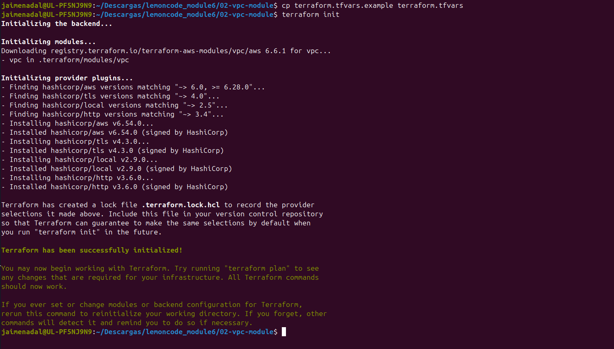
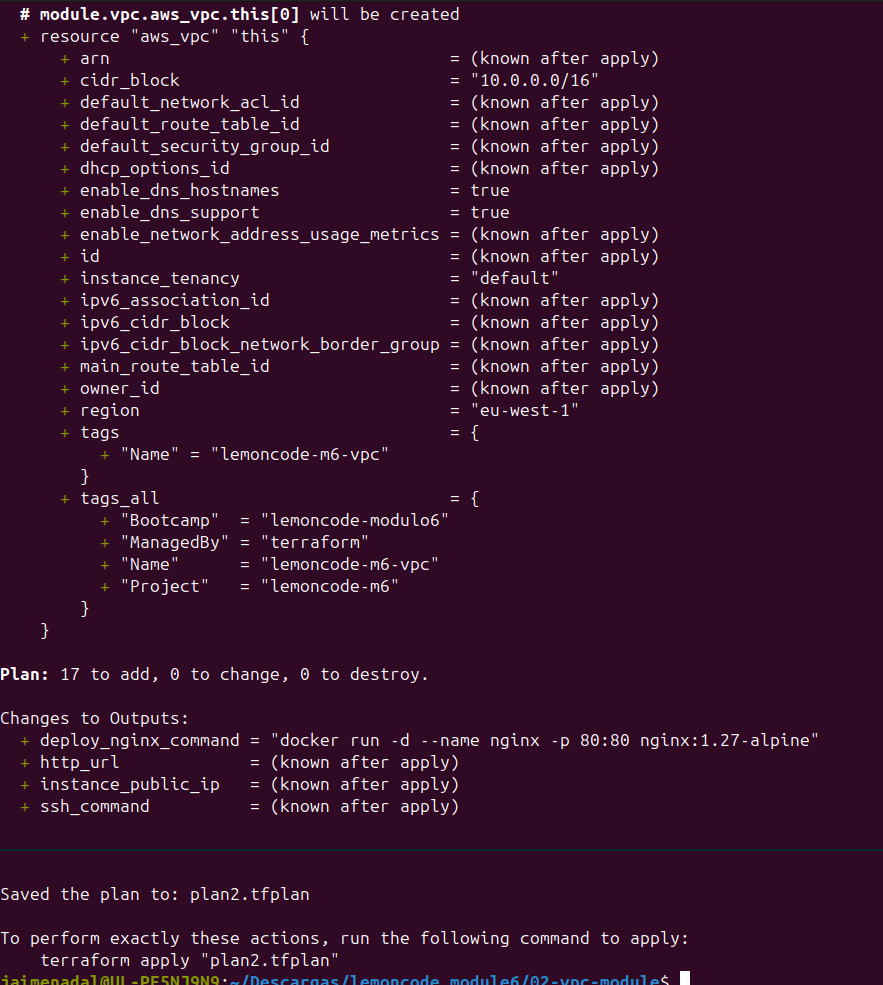
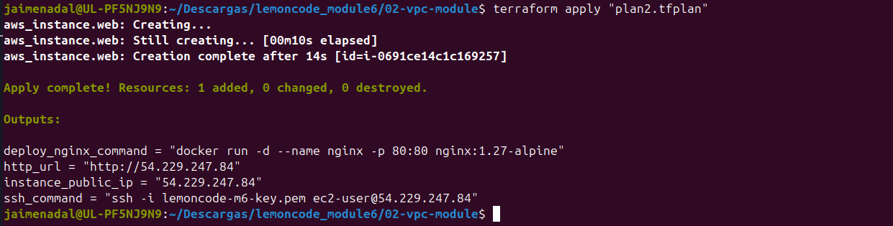
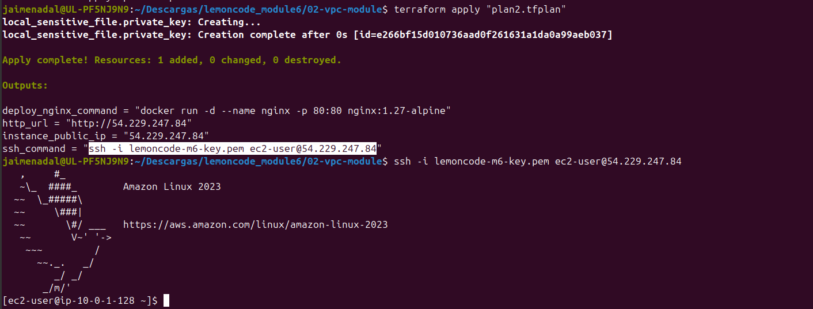
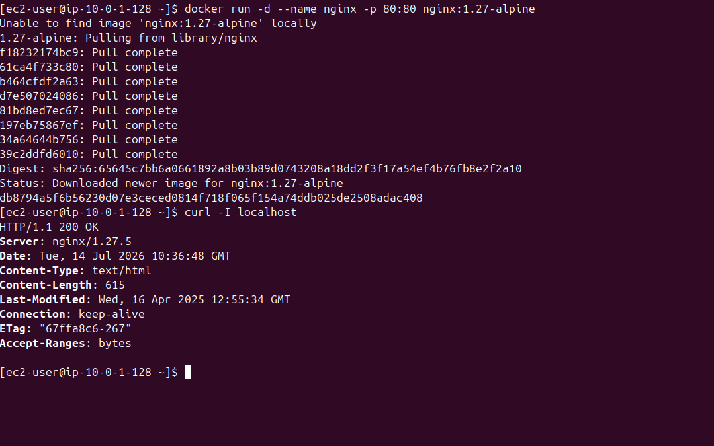
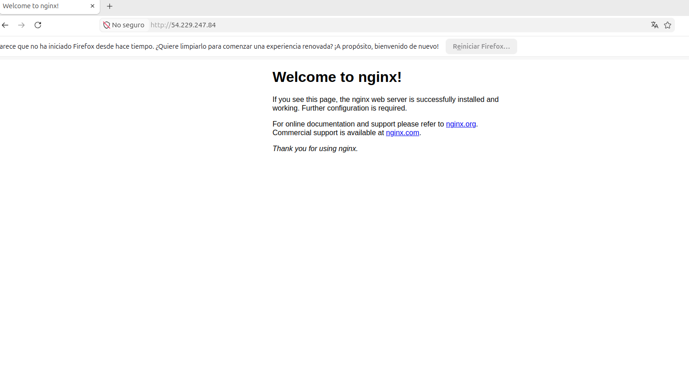
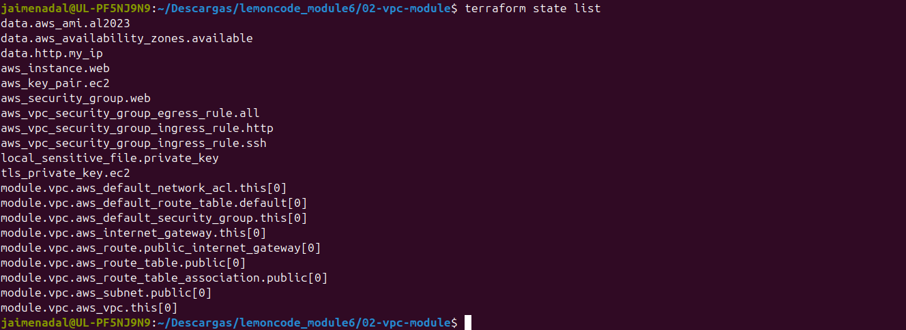
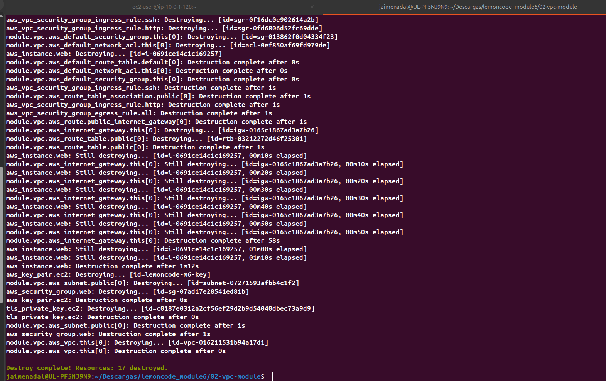

# Fase 2 — Refactor con el VPC Module (`02-vpc-module/`)

Bootcamp DevOps · Módulo 6 · Infraestructura como Código (Terraform + AWS).

Esta fase cumple el **punto 8** del enunciado: mismo resultado que la Fase 1, pero
la red (VPC, subnets, IGW, route tables) la crea el módulo oficial
[`terraform-aws-modules/vpc/aws`](https://registry.terraform.io/modules/terraform-aws-modules/vpc/aws/latest)
en lugar de recursos sueltos. La instancia, el key pair y el security group se
mantienen y apuntan a la red del módulo.

## Cobertura del enunciado

| Punto | Qué pide | Dónde se implementa | Evidencia |
|---|---|---|---|
| 8 | Refactorizar la red con el VPC Module | `main.tf` (bloque `module "vpc"`) | recursos bajo `module.vpc.*` |
| 1–2 | VPC + subnet pública con acceso a internet | `module "vpc"` | plan / `state list` |
| 3 | Security group: 80 abierto, 22 solo mi IP | `security.tf` | apply |
| 4–5 | Key pair + EC2 en la subnet del módulo | `keypair.tf` / `compute.tf` | SSH conectado |
| 6 | `user_data` instala Docker | `user-data.sh.tftpl` | `docker --version` |
| 7 | Output IP pública + NGINX por HTTP | `outputs.tf` | navegador en `http://<IP>` |

## Evidencias

### 1. `terraform init` — descarga del VPC Module (punto 8)

`terraform init` descarga `terraform-aws-modules/vpc/aws` (v6.6.1) además de los
providers. El provider `aws` se resuelve a `~> 6.0, >= 6.28.0` (requisito del
módulo v6) e instala v6.54.0.



### 2. `terraform plan` — la red pasa a `module.vpc.*` (punto 8)

En el plan, la VPC y demás recursos de red aparecen bajo `module.vpc.aws_vpc.this[0]`,
`module.vpc.aws_subnet.public[0]`, etc. Esa es la prueba del refactor.



### 3. `terraform apply` — outputs con la IP pública

Apply correcto y outputs: `instance_public_ip = 54.229.247.84`, `ssh_command`,
`http_url`, `deploy_nginx_command`.



### 4. Conexión SSH a la instancia (puntos 4 y 5)

SSH a `ec2-user@54.229.247.84` usando el `.pem` generado; arranca Amazon Linux 2023.



### 5. Docker por `user_data` + NGINX sirviendo (puntos 6 y 7)

Contenedor NGINX levantado y `curl -I localhost` devolviendo `HTTP/1.1 200 OK`
dentro de la instancia.



### 6. NGINX accesible por la IP pública (punto 7)

Página de bienvenida de NGINX en `http://54.229.247.84` desde el navegador local.



### 7. `terraform state list` — evidencia definitiva del punto 8

El estado muestra la separación: la red bajo `module.vpc.*` (VPC, subnet, IGW,
route table, ruta a internet y asociación) y el resto (instancia, key pair,
security group, reglas) como recursos propios que consumen esa red.



### 8. `terraform destroy` — limpieza

Todos los recursos eliminados (17, incluidos los del módulo) para no incurrir en
gastos.



## Notas

- Diferencia clave con la Fase 1: la red la crea el módulo (`module.vpc.*`); la
  instancia, el key pair y el security group son idénticos y apuntan a esa red.
- El módulo VPC v6 exige el provider `aws >= 6.0`; por eso `versions.tf` fija
  `aws ~> 6.0`.
- Coste: `t3.micro` (free-tier-eligible en cuentas nuevas). `terraform destroy`
  ejecutado al terminar.

## Cómo reproducirlo

```bash
cd 02-vpc-module
cp terraform.tfvars.example terraform.tfvars   # opcional
terraform init          # descarga el VPC Module
terraform plan -out=plan2.tfplan
terraform apply "plan2.tfplan"
# ... verificar SSH, Docker y NGINX ...
terraform destroy
```
